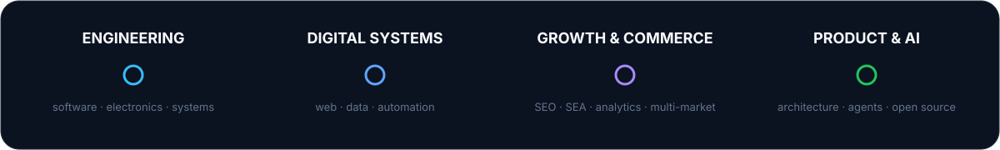
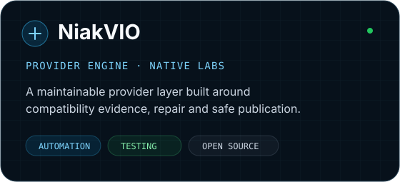
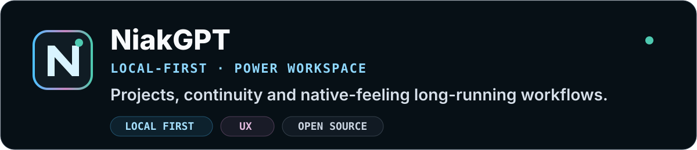
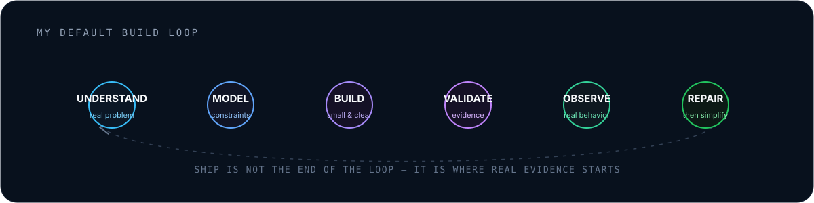

<div align="center">
  

  <br />

  <strong>Engineering × Product × Digital Growth</strong> · Entrepreneur · ex-Head of Digital Marketing Europe · France
  <br /><br />

  <strong>English</strong> · <a href="README.fr.md">Français</a>
  <br /><br />

  <a href="https://github.com/niakw/NiakVIO"></a>
  <a href="https://github.com/niakw/NiakGPT"></a>
  

  <br /><br />

  <a href="#selected-work">Work</a> ·
  <a href="#engineering-roots-digital-scale-product-systems">Journey</a> ·
  <a href="#principles-i-keep-coming-back-to">Principles</a> ·
  <a href="#toolbox">Toolbox</a> ·
  <a href="#github-activity">Activity</a>
</div>

<br />

## I build useful systems out of messy problems.

I'm a **computer engineer by training** with more than a decade across software, web, e-commerce and digital systems. Before leading growth and commerce initiatives, I was already building business applications, web platforms and process automation.

I later led digital marketing and e-commerce across **20+ web properties in four European markets**, working across acquisition, marketplaces, analytics, tracking, conversion and digital operations.

Today I build products where **software architecture, AI, automation, UX and business performance** meet. I care less about adding technology for its own sake than about making difficult workflows simpler, observable, maintainable and genuinely useful.

<br />

<div align="center">
  
</div>

<br />

<table>
<tr>
<td width="50%" valign="top">

### ⚙️ Engineering & systems

I think in interfaces, constraints, data flows, failure modes and maintainability — whether the system is software, automation or a business workflow.

</td>
<td width="50%" valign="top">

### ⚡ Product & growth

I connect the technical layer to users, acquisition, conversion, operations and commercial constraints rather than treating them as separate worlds.

</td>
</tr>
<tr>
<td width="50%" valign="top">

### 🤖 AI & automation

I use AI as a product capability — for reasoning, routing and assisted workflows — while keeping important decisions reviewable.

</td>
<td width="50%" valign="top">

### 🧩 Open source

I prefer tools that are inspectable and reproducible, with clear boundaries between what a system knows, assumes and actually proves.

</td>
</tr>
</table>

<br />

## Selected work

<table>
<tr>
<td width="50%" valign="top">
<a href="https://github.com/niakw/NiakVIO">
  
</a>
</td>
<td width="50%" valign="top">
<a href="https://github.com/niakw/NiakGPT">
  
</a>
</td>
</tr>
</table>

### [NiakVIO](https://github.com/niakw/NiakVIO)

A community engine for Nuvio providers built around **structured provider knowledge, compatibility evidence, repair, native-device Labs and safe publication**. The challenge is keeping a moving ecosystem testable and maintainable across TV, mobile and desktop clients.

[Repository](https://github.com/niakw/NiakVIO) · [Project page](https://projects.eittyweb.fr/en/niakvio/)

`provider architecture` · `automation` · `native labs` · `validation` · `JavaScript`

### [NiakGPT](https://github.com/niakw/NiakGPT)

A **local-first power workspace for ChatGPT** focused on Projects, navigation, continuity and long-running work, with a strong bias toward native-feeling UX and explicit architectural ownership.

[Repository](https://github.com/niakw/NiakGPT) · [Project page](https://projects.eittyweb.fr/en/niakgpt/)

`browser extension` · `local-first` · `UX` · `automation` · `JavaScript`

<br />

## Engineering roots, digital scale, product systems

The technical side did not arrive after marketing — it **predates it**. My background spans application development, information systems, web platforms and digital project work before expanding into European e-commerce and growth leadership.

That hybrid background is why I can move naturally from **SEO/SEA, marketplaces, analytics and conversion** to **APIs, databases, browser tooling, CI/CD, testing, automation and cross-platform architecture** without treating them as unrelated disciplines.

My working rule is simple: **understand the real problem, design the system deliberately, then choose the technology that fits**.

<br />

## Principles I keep coming back to

```text
01  Make the complex thing understandable.
02  Automate repetition — not responsibility.
03  Prefer evidence over “it should work”.
04  Keep failure states visible instead of manufacturing green checks.
05  Use AI to extend judgment, not hide it.
06  Architecture should protect iteration, not impress people.
07  Ship → observe → repair → simplify → repeat.
```

<br />

<div align="center">
  
</div>

<br />

## Toolbox

<div align="center">


</div>

<br />

## Current interests

`AI agents with validation` · `local-first software` · `automation` · `cross-platform tooling` · `observability` · `e-commerce systems` · `product architecture` · `UX`

<br />

## GitHub activity

<div align="center">
  
  <br /><br />
  <picture>
    <source media="(prefers-color-scheme: dark)" srcset="https://raw.githubusercontent.com/niakw/niakw/output/github-contribution-grid-snake-dark.svg" />
    <source media="(prefers-color-scheme: light)" srcset="https://raw.githubusercontent.com/niakw/niakw/output/github-contribution-grid-snake.svg" />
    
  </picture>
</div>

<br />

<div align="center">
  <sub>Open source, product experiments and systems built from real-world constraints.</sub>
  <br /><br />
  
</div>
